# Big Bee Image Sequence Generator

This repository helps to generate image sequence of specimen following Big Bee image sequence naming conventions and creates an archive of the image sequence.

Checkout the [samples](#animated-gifs).

## Prerequisites

 * linux, mac os x, or Windows Subsystem for Linux https://en.wikipedia.org/wiki/Windows_Subsystem_for_Linux
 * Preston https://github.com/bio-guoda/preston
 * ffmpeg 
 * zip

## Usage


```
./create-imageseq [catalog number] [dwca URL]
```

where 

`catalog number` is the catalog number of the specimen you'd like to generate an image sequence for.

and

`dwca URL` is location of the Darwin Core Archive that includes a specimen with the catalog number 

This can be combines with other programs like `cat` to generate image sequences for a list of catalogNumbers:

```
cat catalogNumbers.txt\
 | xargs -L1 ./create-imsageseq 
```

or, if you'd like to do it in parallel:

```
cat catalogNumbers.txt\
 | parallel ./create-imageseq {1}
```


## Results

If found, image sequence data products will be available in folder `dist/[catalog number]/` . 

## Publication

The distributions are optimized for publication to Zenodo. See https://github.com/jhpoelen/zenodo-upload for ways to do this programmatically.

## Example

```
./create-imageseq "UCSB-IZC00012194" "https://library.big-bee.net/portal/content/dwca/UCSB-IZC_DwC-A.zip"
```

produced the following flat (Zenodo compatible) output in the `dist/UCSB-IZC00012194` folder as shown below.

Note that the long cryptic filenames help for machines to discover and verify content using the Preston command-line tool and associated packaging methods. For more information, see https://github.com/bio-guoda/preston or related publications:

MJ Elliott, JH Poelen, JAB Fortes (2020). Toward Reliable Biodiversity Dataset References. Ecological Informatics. https://doi.org/10.1016/j.ecoinf.2020.101132

Elliott, M. J., Poelen, J. H., & Fortes, J. (2022, August 29). Signed Citations: Making Persistent and Verifiable Citations of Digital Scientific Content. https://doi.org/10.31222/osf.io/wycjn


```
find dist -type f
```

```
dist/UCSB-IZC00012194/c74427b91d874b4caf5d293348e484cef331f7897ae7c824e4f34fe1b8e5827b
dist/UCSB-IZC00012194/e1f93d57c522c16c8e54e59e24ceba597d08cc437d97d3da2c584a65a8f2b04e
dist/UCSB-IZC00012194/74c3ab842f34da535c3c7a978519a42e836c64ad0e69820c38fec1983833fec8
dist/UCSB-IZC00012194/eae9c1eaae3272d183a0eb2c5fb36d37c51a3876e8eead91c2bdee70544eeb39
dist/UCSB-IZC00012194/168563c88349b6c9730ce2cf1cc8dcfaf4fefd02211d3c8e00cc66c0096e027c
dist/UCSB-IZC00012194/fb8c70574c1da9f71fed3f8bf8bc364d176e6a9a43e222e0d4766007dda25658
dist/UCSB-IZC00012194/imageseq.zip
dist/UCSB-IZC00012194/README.md
dist/UCSB-IZC00012194/32f069ef9c2de2a595aeed1ec69f3332df79e47e5f9c666ea0203d1948885a57
dist/UCSB-IZC00012194/0ffc28ade359ceb5f265bcde53b97acfa3a0ef376436a2a216afdd5b8c0feae3
dist/UCSB-IZC00012194/ab5860f5ad1650a11ef277de103f11eb950668ef2c9aa3521eff1e059a0160d2
dist/UCSB-IZC00012194/2a5de79372318317a382ea9a2cef069780b852b01210ef59e06b640a3539cb5a
dist/UCSB-IZC00012194/0921861a58fbe0fda711bd23bdcb8774306e0f884636e44b375ffccbf67feb65
dist/UCSB-IZC00012194/6d1f477f166e181c9f75b6177c8b95a51c0b17a720c58a6ef7b41a5278e5c9ac
dist/UCSB-IZC00012194/94aef3a2b96ed627c1655f24a7e8210ab41b8e2137ff0818a092af20bbe2b209
dist/UCSB-IZC00012194/d06a7978dcc5d42021342ddad06364793f4d81d2daeeaf1cc31512088bbb39f3
dist/UCSB-IZC00012194/290184df10c8a6390bc1debde079418e06dcef559d595f5d73fe0e9fff6e5879
dist/UCSB-IZC00012194/064bc7772b2284c42917b785706ae72c196e9443dd394069ceee0f9cd8237e93
dist/UCSB-IZC00012194/77ffab8c3ae190f21376efd1d4dfa2ddc329efd69f133ee712f99f26223e1627
dist/UCSB-IZC00012194/f23a657a42456913121a0482e78c443195094c563e7a22c10fe4b77963a5c61c
dist/UCSB-IZC00012194/3bbb2adf89137c7ffec8781f4be3b9ff54c3da770b00527c03139004e4a074a7
dist/UCSB-IZC00012194/2bc7d44f410314c5466a2832d673d6294887f664757318d07d843ad2cd38e3e6
dist/UCSB-IZC00012194/507eeebdafcf5211b249df63fcd14849cc9149c0621e8c4485f5c957f3e91445
dist/UCSB-IZC00012194/imageseq.gif
dist/UCSB-IZC00012194/5eb0fe8feb8158002a62ad134d7ae25dd101d0389887172ac3351fdbc186e41d
dist/UCSB-IZC00012194/a667b2a0c74e44d2076479c0280a89f89ced3d72d7f680b5101a2078c21cfd6d
dist/UCSB-IZC00012194/label.png
dist/UCSB-IZC00012194/ff8b55538305ea8c9268cf4f2c533ddf05ed21cff27ba088b7637fae9654b7ed
dist/UCSB-IZC00012194/d0e42a073c98c93beeff95caf987d4b4aa022f3b9045472070d51c7b56771014
```

## Animated GIFs

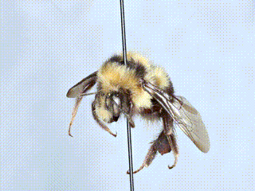
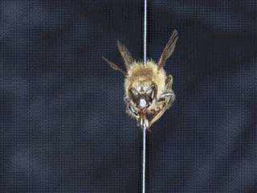
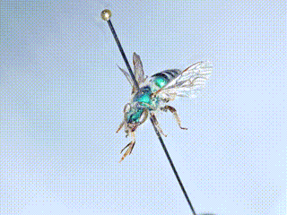
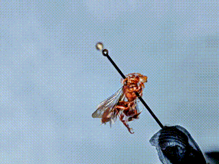
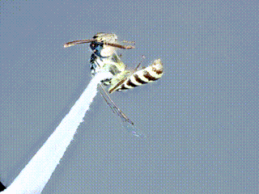
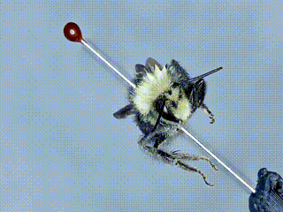
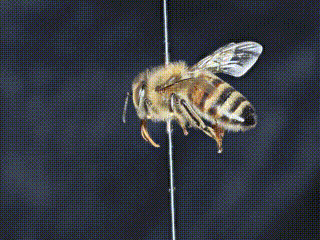
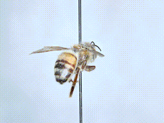
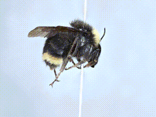
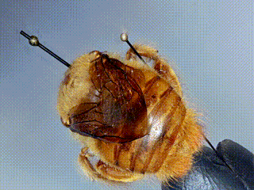
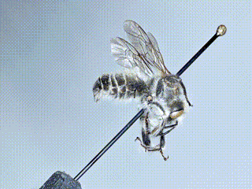
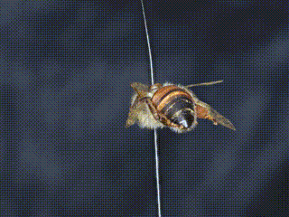
